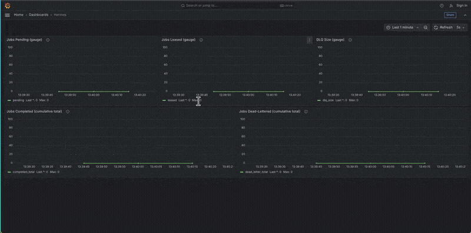
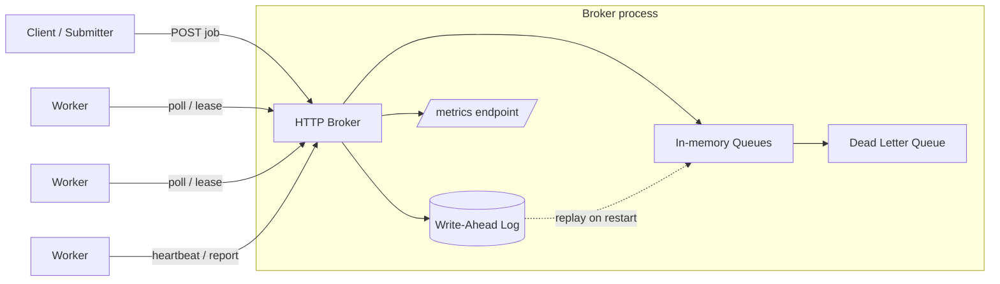
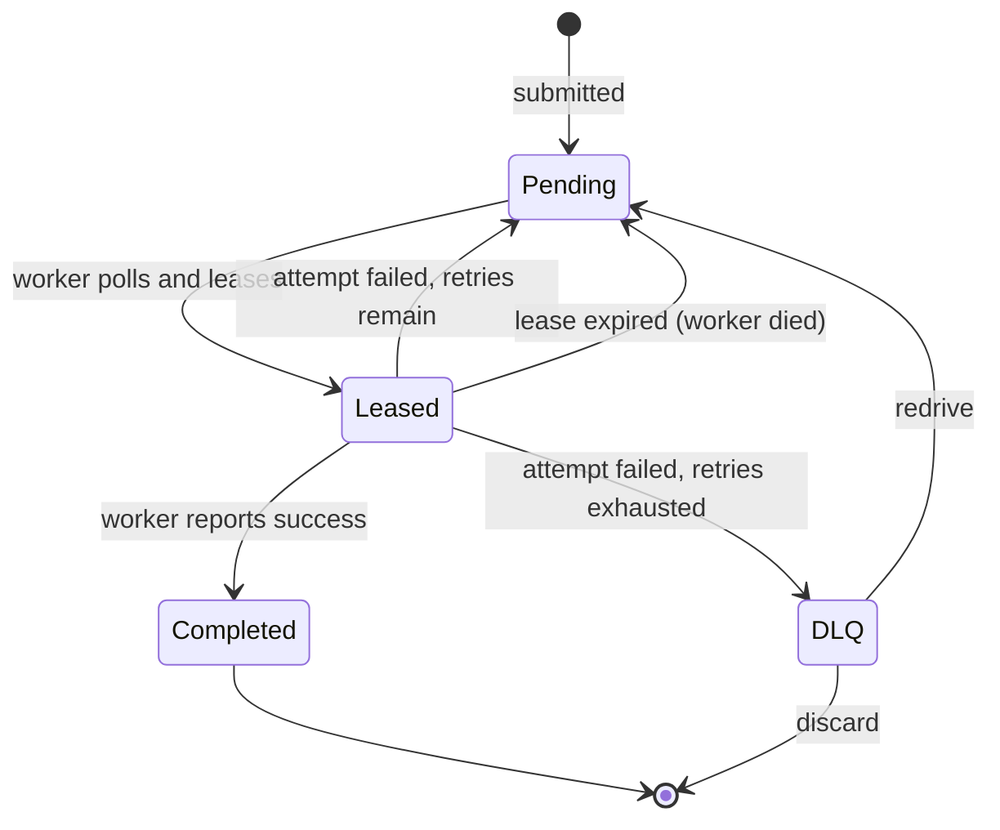

# Project Hermes

A production-grade distributed task queue and job scheduler, built from scratch in Go.



Hermes lets you submit background jobs and have them processed reliably across a pool of workers, surviving both worker crashes and broker restarts. It is built entirely from first principles: no Redis, no RabbitMQ, no Kafka, no external message broker of any kind. The queuing, failure detection, durability, and crash recovery are all implemented directly on top of Go's standard library and a hand-rolled write-ahead log.

That constraint is deliberate. The value of Hermes is not that it queues jobs; plenty of tools do that. It is that every hard part a real task queue has to solve is solved here in code you can read and reason about.

## What the demo shows

A load generator drives jobs into the broker while a worker pool drains them.
Partway through, the broker process is killed mid-flight, then restarted.

1. **Climb.** Jobs are submitted faster than the workers drain them, so
   `pending` accumulates and `leased` settles at the worker-pool size.
   Poison jobs exhaust their retries and land in the dead-letter queue.

2. **Crash.** The broker is stopped. Prometheus can no longer scrape it, so
   the series break: there is no data at all for the duration of the outage.

3. **Recovery.** The broker restarts and replays its write-ahead log.
   - `leased` returns to **zero**: lease state is ephemeral and is deliberately
     discarded on recovery. Jobs that were in flight are reset to pending.
   - `pending` **absorbs those in-flight jobs** (131 pending + in-flight → 138).
     No work is lost.
   - `dlq_size` **holds its pre-crash value**: dead-letter membership is durable.
   - The counters **reset to zero**. They live in memory and are legitimately
     lost; what matters for a counter is its rate, not its lifetime total.

The gauges returning while the counters reset is the point: durable state
survives the crash, ephemeral state does not, and the split is by design.

## Contents

- [Why Hermes](#why-hermes)
- [Feature overview](#feature-overview)
- [Architecture](#architecture)
- [Job lifecycle](#job-lifecycle)
- [How the hard parts work](#how-the-hard-parts-work)
- [Project structure](#project-structure)
- [Getting started](#getting-started)
- [HTTP API reference](#http-api-reference)
- [Observability](#observability)
- [Testing](#testing)
- [Design decisions](#design-decisions)
- [Deployment](#deployment)
- [Roadmap](#roadmap)

## Why Hermes

Background job processing sits behind almost every real system. When you place an order and a confirmation email arrives seconds later, that email was not sent inline with your request; it was pushed onto a queue and picked up by a worker. Hermes is that infrastructure, built by hand.

The engineering questions it forces you to answer are the interesting ones:

- What happens when a worker dies halfway through a job, and how do you reassign the work without running it twice?
- How does a job survive the broker process itself restarting?
- How do you tell an operator, at a glance, whether the system is healthy or silently falling behind?
- How do you keep concurrent access to shared queue state correct without deadlocking yourself?

Every one of these is answered in the sections below.

## Feature overview

- **HTTP broker** built on the `net/http` standard library, with method-prefixed routing (`POST /queues/{queueName}/jobs`).
- **In-memory queues** with thread-safe access across concurrent submitters and workers.
- **Poll-based worker pool**: N concurrent workers that pull jobs, execute them, and report results back to the broker.
- **Lease-based job locking**: a leased job is invisible to other workers until its lease expires, preventing double execution.
- **Heartbeats and lease renewal**: long-running jobs extend their lease so they are not wrongly reclaimed.
- **Automatic recovery from worker death**: expired leases return the job to the pending pool for reassignment.
- **Retry logic with a retry-count ceiling**: failed attempts are retried until `max_retries` is exhausted, then dead-lettered.
- **Dead letter queue (DLQ)** with inspect, redrive, and discard operations.
- **Crash-safe persistence** via a hand-rolled, CRC32-checksummed write-ahead log with durable `fsync` appends and full replay-based recovery.
- **Prometheus-format metrics** exposed at `/metrics`, covering the full job lifecycle.
- **Structured logging** via `log/slog`.

## Architecture

Hermes has three moving parts: a central broker, a pool of workers, and a durable write-ahead log the broker writes to before it mutates any state.



The broker owns all queue state. Workers hold no authoritative state of their own; they are anonymous pollers that ask the broker for work, do it, and report back. This is a deliberate design choice: because workers do not register with the broker, the broker never has to track worker liveness directly. It only tracks lease liveness, which is simpler and more robust.

## Job lifecycle

A single job moves through a small set of states. Every transition is a place where work can pile up or fail, which is exactly why each one is instrumented.



A lease expiring is treated as a failed attempt. The broker cannot tell the difference between a worker that crashed and a worker whose job legitimately failed, so it counts both the same way. This is the operationally honest choice: from the broker's point of view, a job that was handed out and never confirmed is a job that did not succeed.

## How the hard parts work

### Fault tolerance: leases, not liveness

When a worker requests a job, the broker does not hand it out and forget about it. It stamps the job with a lease: the job is now invisible to every other worker until that lease expires. The worker processes the job and, on success, reports completion; on failure, it reports failure.

If the worker dies, it stops renewing the lease. A background lease checker running inside the broker periodically scans for expired leases and returns those jobs to the pending pool, where the next polling worker will pick them up. There is no heartbeat-based worker registry to maintain and no separate failure detector to get wrong. Lease expiry *is* the failure signal.

Long-running jobs would otherwise be at risk of having their lease expire mid-execution. To prevent that, workers send periodic heartbeats that renew the lease, keeping a legitimately-running job safe from reclamation.

### Retries and the dead letter queue

Each job carries a retry count and a `max_retries` ceiling. When an attempt fails:

- If retries remain, the retry count is incremented and the job returns to pending for another attempt.
- If retries are exhausted, the job is moved to the dead letter queue rather than being retried forever.

The DLQ is a holding area for jobs that could not be completed, so a single poison-pill job cannot spin forever consuming worker capacity. Dead-lettered jobs can be inspected, redriven back into the queue after a fix, or discarded.

### Persistence: a hand-rolled write-ahead log

Everything above lives in memory, which means a broker restart would ordinarily lose every job. Hermes closes that gap with a write-ahead log that it owns and implements directly, rather than reaching for an embedded database.

The core discipline is write-ahead ordering: **the broker appends a record to the log before it mutates in-memory state, at every mutation point.** If the process dies between the two, recovery replays the log and reconstructs the state that the mutation would have produced.

Each record is framed on disk as:

```
[length][checksum][type][payload]
```

- `length` and `checksum` are fixed 4-byte big-endian headers.
- The CRC32 (IEEE) checksum covers `[type][payload]`, the same content bytes the length counts.
- Appends are followed by `fsync`, so a returned write is a durable write.

On startup, `Recover` replays the log from the beginning, rebuilds the broker's queues, and resets in-flight jobs to pending (an interrupted lease is discarded, since the worker holding it is gone). Retry counts and scheduling timestamps survive recovery deliberately: resetting them would defeat poison-pill protection.

Recovery also handles a torn tail. Under a clean shutdown, only the final record can be partially written, so on hitting a truncated or checksum-failing record at the end of the log, recovery stops and keeps everything read so far rather than discarding valid earlier records or trying to repair mid-log corruption it cannot reason about.

### Concurrency correctness

Queue state is shared across concurrent submitters, pollers, and the lease checker. Access is guarded by a mutex, with a locked-core pattern to avoid the classic deadlock where a helper function tries to re-acquire a lock the caller already holds. Go's `sync.Mutex` is not reentrant, so this separation is load-bearing, not stylistic. The full test suite runs under the race detector.

## Project structure

```
project-hermes/
  cmd/
    broker/          # broker server entrypoint
    demo/            # crash-and-restart demo harness
    loadgen/         # continuous job submitter for driving the demo
  internal/
    models/          # shared types: Job, JobStatus (neutral package both broker and worker import)
    broker/          # BrokerServer, Queue, HTTP handlers, lease checker
    worker/          # Worker and worker pool: poll, process, report, heartbeat
    wal/             # write-ahead log: Encode/Decode, Append, Recover, framing + checksums
    metrics/         # Metrics struct (atomic counters/gauges), Snapshot, Prometheus rendering
  infra/             # Terraform: DigitalOcean Kubernetes cluster, lifecycle scripts
  k8s/               # Kubernetes manifests: StatefulSet, Services, RBAC, Prometheus, Grafana
  prometheus/        # Prometheus config for the local docker-compose stack
  grafana/           # Grafana provisioning and committed dashboard JSON
  docs/              # architecture notes and decision records
  docker-compose.yml
  Dockerfile
  go.mod
```

The `models` package exists specifically so that `broker` and `worker` never import each other. In a real deployment these are separate processes that share a contract over HTTP, not a codebase; keeping the shared types in a neutral package mirrors that boundary.

## Getting started

### Prerequisites

- Go 1.22 or newer (Hermes uses typed atomics, method-prefixed HTTP routing, and `slices.Delete`).

### Build

```bash
git clone https://github.com/epaitoo/project-hermes.git
cd project-hermes
go build ./...
```

### Run the broker

```bash
go run ./cmd/broker
```

The broker listens on `:8080` by default.

### Submit a job

```bash
curl -X POST http://localhost:8080/queues/email/jobs \
  -H "Content-Type: application/json" \
  -d '{"name":"welcome-email","task_type":"email","max_retries":3}'
```

### Watch crash recovery

The demo harness drives the full loop: it submits jobs, runs workers against them, and can be killed and restarted to show that persisted jobs survive a broker restart with no loss.

```bash
go run ./cmd/demo
```

## HTTP API reference

| Method   | Path                                          | Description                                      |
|----------|-----------------------------------------------|--------------------------------------------------|
| `POST`   | `/queues/{queueName}/jobs`                    | Submit a job to a queue.                          |
| `GET`    | `/queues/{queueName}/jobs`                    | Poll for and lease the next available job.        |
| `PUT`    | `/queues/{queueName}/jobs/{jobId}`            | Report a job result (for example, completion).    |
| `POST`   | `/queues/{queueName}/jobs/{jobId}/heartbeat`  | Renew the lease on an in-flight job.              |
| `POST`   | `/jobs/{jobId}/fail`                          | Report a failed attempt (retries or dead-letters).|
| `GET`    | `/queues/{queueName}/dlq`                     | List dead-lettered jobs for a queue.              |
| `POST`   | `/queues/{queueName}/dlq/{jobId}/redrive`     | Move a dead-lettered job back into the queue.     |
| `DELETE` | `/queues/{queueName}/dlq/{jobId}`             | Permanently discard a dead-lettered job.          |
| `GET`    | `/metrics`                                    | Prometheus-format metrics.                        |

## Observability

Hermes exposes seven metrics at `/metrics` in Prometheus exposition format, chosen to answer real operator questions rather than to fill a dashboard. The guiding rule: start from "a submitter says their jobs seem stuck; what would I need to measure to diagnose it?" and derive the minimum set of signals from there.

**Counters** (monotonic; reset to zero on restart, because the meaningful thing about a counter is its rate):

- `hermes_jobs_submitted_total`
- `hermes_jobs_completed_total`
- `hermes_jobs_dead_letter_total`
- `hermes_jobs_attempt_failure_total`

A single coarse "failed" counter was deliberately split into `hermes_jobs_attempt_failure_total` and `hermes_jobs_dead_letter_total`. Collapsing them into one number hides retry churn: a queue thrashing on retries and a queue quietly giving up on jobs would look identical, and they are very different problems.

**Gauges** (can go down; restored during recovery, because recovery reconstructs the true current state):

- `hermes_jobs_pending`
- `hermes_jobs_leased`
- `hermes_jobs_dlq_size`

Metric increments follow a strict placement rule: a counter is only bumped past the last point where the operation can still fail. The WAL append is that commit boundary, so a job is not counted as submitted until it is durably logged.

A metric for live worker count was considered and dropped: with anonymous poll-based workers there is no registration concept for the broker to count, so the honest answer is that the metric is architecturally infeasible here.

## Testing

```bash
go test -race ./...
```

The suite includes table-driven unit tests, a concurrency test on the metrics struct under the race detector, integration-style wiring tests that assert metric snapshots after real broker operation sequences, a recovery test that would catch a gauge miscount after replay, and torn-write tests that truncate and byte-flip the log to exercise the recovery paths.

## Design decisions

Hermes is as much about the reasoning behind the design as the code. The architecture decision records live in `docs/adr/` and cover, among others:

- Why a hand-rolled write-ahead log rather than an embedded database like BoltDB.
- Why lease expiry is counted as a retry rather than tracked as a distinct state.
- Why in-flight leases are discarded on recovery while retry counts survive.
- Why the log framing puts the checksum ahead of the content it protects, and why only the tail is assumed torn.

## Deployment

Hermes runs on managed Kubernetes, provisioned from code. Infrastructure lives in `infra/` (Terraform), workload manifests in `k8s/`.

### Infrastructure

A DigitalOcean Kubernetes cluster is declared in Terraform. The Kubernetes version is resolved through a data source rather than pinned to a literal, so the config does not go stale as DigitalOcean retires patch releases:

```hcl
data "digitalocean_kubernetes_versions" "current" {
  version_prefix = "1."
}

resource "digitalocean_kubernetes_cluster" "hermes" {
  version  = data.digitalocean_kubernetes_versions.current.latest_version
  vpc_uuid = data.digitalocean_vpc.default.id
  ...
}
```

Two helper scripts wrap the lifecycle, since the cluster is created and destroyed per working session rather than left running:

```bash
cd infra
./up.sh     # terraform apply, fetch kubeconfig via doctl, apply manifests, verify nodes
./down.sh   # terraform destroy, then confirm no clusters or volumes remain
```

`down.sh` verifies teardown rather than assuming it. Orphaned block-storage volumes bill silently, so the script queries for leftovers after destroying, and the cluster sets `destroy_all_associated_resources = true` so volumes provisioned inside it are removed with it.

Cost-bearing fields are set explicitly rather than left to provider defaults. `ha = false` in particular: the high-availability control plane is roughly three times the cost of the worker node this cluster runs, and a field that shows as `(known after apply)` in a plan is a field whose price you have not actually agreed to.

### Why a StatefulSet, not a Deployment

The broker owns a write-ahead log on local disk. That single fact makes it a stateful singleton rather than an interchangeable replica, and it drives three decisions:

- **StatefulSet over Deployment**: a Deployment treats pods as anonymous and fungible, naming them randomly and replacing them in any order. The broker needs stable identity, so that the replacement for `hermes-broker-0` is also `hermes-broker-0` and reattaches to the same volume.
- **`volumeClaimTemplates` over a standalone PVC**: the StatefulSet stamps out one claim per pod, named `wal-hermes-broker-0`, bound to that pod permanently. A Deployment has no way to express "this pod, specifically, gets that volume."
- **`replicas: 1`**: two brokers would each hold independent in-memory state backed by separate WALs, and clients would see two divergent views of the same queue. `ReadWriteOnce` block storage enforces the same conclusion from the storage side: a block device cannot be safely written by two nodes at once.

One deployment detail worth recording: the container runs as uid 65532 under distroless, and the Dockerfile chowns `/data` to that uid at build time. Mounting a volume at `/data` replaces that directory entirely, and a freshly provisioned volume is root-owned, so `wal.Open` fails with permission denied. The fix is a pod-level `securityContext` with `fsGroup: 65532`, which makes Kubernetes set group ownership on the volume before the container starts.

### Deployed state

```
NAME                             READY   AGE
statefulset.apps/hermes-broker   1/1     15m

NAME                             TYPE        CLUSTER-IP      PORT(S)    AGE
service/hermes-broker            ClusterIP   10.115.24.212   8080/TCP   14m
service/hermes-broker-headless   ClusterIP   None            8080/TCP   13m

NAME                  READY   STATUS    RESTARTS   AGE
pod/hermes-broker-0   1/1     Running   0          6m37s

NAME                  STATUS   VOLUME                                     CAPACITY   ACCESS MODES   STORAGECLASS
wal-hermes-broker-0   Bound    pvc-dc27ae1c-65b3-4212-a8d7-a6a347c933f8   1Gi        RWO            do-block-storage
```

Two services, deliberately. `hermes-broker` is a normal ClusterIP that workers connect to at a stable in-cluster address, `hermes-broker:8080`, without caring which pod answers. `hermes-broker-headless` has no cluster IP at all; it exists to give each pod its own DNS record, which is what a StatefulSet requires to provide per-pod network identity.

The ages in that output are the interesting part. The StatefulSet and the PVC are 15 minutes old; the pod is 6 minutes old. The pod was destroyed and recreated while its storage persisted underneath it.

### Durability across pod destruction

The WAL's guarantee is only meaningful if it survives the pod being destroyed, not merely the process restarting. Verified directly against the cluster.

Five jobs submitted, then the pod deleted outright:

```bash
for i in 1 2 3 4 5; do
  curl -s -X POST http://localhost:8080/queues/email/jobs \
    -H "Content-Type: application/json" \
    -d "{\"name\":\"k8s-test-$i\",\"task_type\":\"email\",\"max_retries\":3}"
done

kubectl delete pod hermes-broker-0
```

After Kubernetes recreated the pod, `/metrics` on the new process reports:

```
hermes_jobs_submitted_total 0
hermes_jobs_completed_total 0
hermes_jobs_dead_letter_total 0
hermes_jobs_attempt_failure_total 0
hermes_jobs_pending 5
hermes_jobs_leased 0
hermes_jobs_dlq_size 0
```

Every counter reads zero and the `pending` gauge reads five, and that split is the design working as intended. Counters measure the rate of activity through a running process; this is a new process, so it has submitted nothing and starts from zero. Gauges describe current state, and `Recover()` rebuilds them by replaying the log, so `pending` reflects what is actually in the queue.

Five jobs submitted to a process that no longer exists, still queued. The container filesystem was discarded with the pod. The WAL was not, because it lives on a block-storage volume that outlives the pod bound to it.

### Observability on Kubernetes

The compose stack points Prometheus at a static target, `broker:8080`, which works because Docker gives every service a fixed hostname. Kubernetes breaks that assumption: pods are mortal and their replacements get new IPs, so a static target list is stale the moment anything restarts.

The Kubernetes config uses service discovery instead. Prometheus holds a watch on the Kubernetes API, and a relabel pipeline filters the resulting pod list down to those that opt in via annotation:

```yaml
relabel_configs:
  - source_labels: [__meta_kubernetes_pod_annotation_prometheus_io_scrape]
    action: keep
    regex: true
```

The broker opts in with three lines on its pod template:

```yaml
annotations:
  prometheus.io/scrape: "true"
  prometheus.io/port: "8080"
  prometheus.io/path: "/metrics"
```

Neither side names the other. The Prometheus config never mentions Hermes, and the broker knows nothing about Prometheus; they meet through a convention. The same loose coupling appears twice more in this deployment: labels connect the StatefulSet to its pods, and selectors connect Services to pods.

The effect is visible in practice. DigitalOcean annotates its own `cilium` pods with the same convention, so they are discovered and scraped without any configuration on either side.

Prometheus reads the cluster through a ServiceAccount bound to a ClusterRole granting `get`, `list`, and `watch` on pods, services, endpoints, and nodes, and nothing else. The `watch` verb is what makes discovery responsive: new pods are picked up within seconds rather than at the next polling cycle.

Grafana's provisioning carries over from the compose stack unchanged. The datasource points at `http://prometheus:9090`, a name that resolves identically whether the DNS comes from Docker's embedded resolver or from CoreDNS resolving a Service. Both provisioning files and the dashboard JSON are mounted as ConfigMaps, generated from the committed files rather than duplicated:

```bash
kubectl create configmap grafana-dashboards \
  --from-file=grafana/dashboards/hermes.json \
  --dry-run=client -o yaml > k8s/grafana-dashboards-configmap.yaml
```

Prometheus runs as a Deployment with an `emptyDir`, deliberately without persistence. Its data is derived state: losing it costs history, but nothing is corrupted and the system keeps working. The broker's WAL is authoritative state, where loss means losing jobs a client was told were accepted. That distinction, not "is it a database," is what drives the StatefulSet-versus-Deployment decision.

Neither Prometheus nor Grafana is exposed publicly. Both are `ClusterIP` services reached by port-forwarding, which costs nothing; a managed load balancer would be a recurring monthly charge, and a NodePort would put an unauthenticated Grafana on a public IP.

### Continuous integration and delivery

Every push to `main` runs a three-stage pipeline in GitHub Actions: test, build, and pin.

```
test           go vet, then go test -race ./...
  ↓ needs
build          build the image, push to ghcr.io under two tags
  ↓ needs
update-manifest  rewrite the StatefulSet's image reference, commit it back
```

The `needs:` dependency between stages is what makes this a pipeline rather than three scripts. A failing test stops the build, so a broken commit never produces a published image.

#### Immutable tags

The pipeline pushes each build under two tags:

```yaml
tags: |
  ghcr.io/epaitoo/project-hermes:${{ github.sha }}
  ghcr.io/epaitoo/project-hermes:latest
```

`latest` is a mutable pointer, and mutability is the problem. Pushing a new image under the same tag leaves the name unchanged, so Kubernetes has no way to tell that the running pod is out of date, and the node's cached layer may be used instead of the new one. The symptom is a deploy that reports success while the old code keeps running.

Tagging by commit SHA makes every build uniquely addressable. The running container traces back to an exact commit, and rollback is a matter of pointing at an earlier SHA rather than rebuilding anything. `latest` is kept only as a convenience pointer for local pulls.

#### Credentials

The build job authenticates to the registry with `secrets.GITHUB_TOKEN`, which is not a stored secret. GitHub mints it per workflow run, scopes it to this repository, and expires it when the run ends. Nothing long-lived is stored anywhere.

Permissions are granted per job rather than globally:

```yaml
build:
  permissions:
    contents: read
    packages: write

update-manifest:
  permissions:
    contents: write
```

The build job can publish an image but cannot alter the repository; the manifest job can commit but has no registry access. The repository-level setting raises the ceiling on what a token may request, but these per-job blocks remain the effective constraint.

#### Why not GitOps

The conventional choice at this point is a pull-based agent in the cluster, Argo CD or Flux, watching the repository and reconciling. It is the better architecture in general: the cluster reaches out to git rather than CI reaching into the cluster, so no external system holds cluster credentials, and drift from manual changes gets corrected automatically.

It was rejected here because of this cluster's lifecycle. The cluster is created and destroyed per working session, so a reconciliation agent would spend most of its existence not running, and would need reinstalling on every `up.sh`. Continuous reconciliation solves drift over days and weeks; a cluster that lives for two hours and is then rebuilt from scratch has essentially no drift to correct. The agent's components would also be a poor fit for the memory left on a single small node after Kubernetes, Prometheus, and Grafana.

What the pipeline does instead is stop one step short of deploying. CI updates the manifest in git and commits it; the `kubectl apply` happens when the cluster next comes up. Git remains the source of truth for which image should be running, but no credential for the cluster exists outside the machine that provisions it. The tradeoff is honest: this is not continuous deployment, because nothing deploys until a cluster exists. Given the cluster usually does not, that costs nothing.

#### Guarding against a commit loop

The manifest job pushes a commit to `main`, which is itself a trigger for the workflow. Left unguarded, that recurses indefinitely:

```bash
if git diff --quiet; then
  echo "Manifest already current, nothing to commit."
  exit 0
fi
```

The second run finds the manifest already pinned to the current SHA, has nothing to commit, and exits. The trigger also ignores documentation-only changes, so a README edit does not rebuild a container.

#### Pull policy

The StatefulSet sets `imagePullPolicy: Always`. Kubernetes defaults to `IfNotPresent` for non-`latest` tags, preferring the node's cached copy. With SHA tags every image is genuinely new so the cache would miss regardless, but stating the policy removes a category of stale-image confusion rather than relying on the tag scheme to make it impossible.

## Roadmap

Completed:

- Core broker with in-memory queues and a job submission API.
- Poll-based worker pool with the full job lifecycle.
- Fault tolerance: leases, heartbeats, retries, and a dead letter queue.
- Persistence: write-ahead log with durable appends and crash recovery.
- Observability: lifecycle metrics, a Prometheus endpoint, and Grafana dashboards as code.
- Deployment: Terraform-provisioned managed Kubernetes, with the broker as a StatefulSet on persistent block storage and the observability stack running on-cluster.
- CI/CD: automated test, build, and deploy on push.


Intentionally out of scope for now: a delayed and recurring job scheduler, and production hardening such as rate limiting and backpressure. These are natural next steps rather than gaps in the core design.