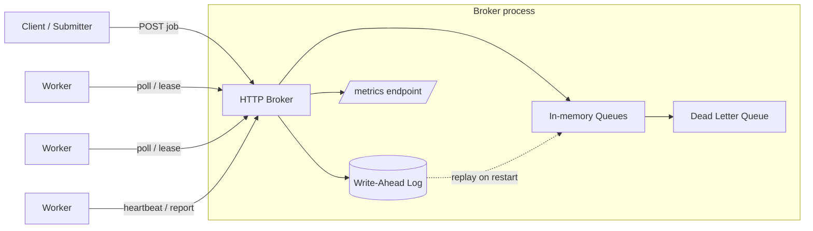
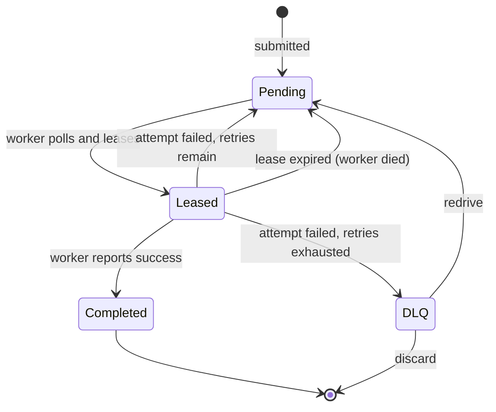

# Project Hermes

A production-grade distributed task queue and job scheduler, built from scratch in Go.

Hermes lets you submit background jobs and have them processed reliably across a pool of workers, surviving both worker crashes and broker restarts. It is built entirely from first principles: no Redis, no RabbitMQ, no Kafka, no external message broker of any kind. The queuing, failure detection, durability, and crash recovery are all implemented directly on top of Go's standard library and a hand-rolled write-ahead log.

That constraint is deliberate. The value of Hermes is not that it queues jobs; plenty of tools do that. It is that every hard part a real task queue has to solve is solved here in code you can read and reason about.

## Contents

- [Why Hermes](#why-hermes)
- [Feature overview](#feature-overview)
- [Architecture](#architecture)
- [Job lifecycle](#job-lifecycle)
- [How the hard parts work](#how-the-hard-parts-work)
- [Project structure](#project-structure)
- [Getting started](#getting-started)
- [HTTP API reference](#http-api-reference)
- [Observability](#observability)
- [Testing](#testing)
- [Design decisions](#design-decisions)
- [Roadmap](#roadmap)

## Why Hermes

Background job processing sits behind almost every real system. When you place an order and a confirmation email arrives seconds later, that email was not sent inline with your request; it was pushed onto a queue and picked up by a worker. Hermes is that infrastructure, built by hand.

The engineering questions it forces you to answer are the interesting ones:

- What happens when a worker dies halfway through a job, and how do you reassign the work without running it twice?
- How does a job survive the broker process itself restarting?
- How do you tell an operator, at a glance, whether the system is healthy or silently falling behind?
- How do you keep concurrent access to shared queue state correct without deadlocking yourself?

Every one of these is answered in the sections below.

## Feature overview

- **HTTP broker** built on the `net/http` standard library, with method-prefixed routing (`POST /queues/{queueName}/jobs`).
- **In-memory queues** with thread-safe access across concurrent submitters and workers.
- **Poll-based worker pool**: N concurrent workers that pull jobs, execute them, and report results back to the broker.
- **Lease-based job locking**: a leased job is invisible to other workers until its lease expires, preventing double execution.
- **Heartbeats and lease renewal**: long-running jobs extend their lease so they are not wrongly reclaimed.
- **Automatic recovery from worker death**: expired leases return the job to the pending pool for reassignment.
- **Retry logic with a retry-count ceiling**: failed attempts are retried until `max_retries` is exhausted, then dead-lettered.
- **Dead letter queue (DLQ)** with inspect, redrive, and discard operations.
- **Crash-safe persistence** via a hand-rolled, CRC32-checksummed write-ahead log with durable `fsync` appends and full replay-based recovery.
- **Prometheus-format metrics** exposed at `/metrics`, covering the full job lifecycle.
- **Structured logging** via `log/slog`.

## Architecture

Hermes has three moving parts: a central broker, a pool of workers, and a durable write-ahead log the broker writes to before it mutates any state.



The broker owns all queue state. Workers hold no authoritative state of their own; they are anonymous pollers that ask the broker for work, do it, and report back. This is a deliberate design choice: because workers do not register with the broker, the broker never has to track worker liveness directly. It only tracks lease liveness, which is simpler and more robust.

## Job lifecycle

A single job moves through a small set of states. Every transition is a place where work can pile up or fail, which is exactly why each one is instrumented.



A lease expiring is treated as a failed attempt. The broker cannot tell the difference between a worker that crashed and a worker whose job legitimately failed, so it counts both the same way. This is the operationally honest choice: from the broker's point of view, a job that was handed out and never confirmed is a job that did not succeed.

## How the hard parts work

### Fault tolerance: leases, not liveness

When a worker requests a job, the broker does not hand it out and forget about it. It stamps the job with a lease: the job is now invisible to every other worker until that lease expires. The worker processes the job and, on success, reports completion; on failure, it reports failure.

If the worker dies, it stops renewing the lease. A background lease checker running inside the broker periodically scans for expired leases and returns those jobs to the pending pool, where the next polling worker will pick them up. There is no heartbeat-based worker registry to maintain and no separate failure detector to get wrong. Lease expiry *is* the failure signal.

Long-running jobs would otherwise be at risk of having their lease expire mid-execution. To prevent that, workers send periodic heartbeats that renew the lease, keeping a legitimately-running job safe from reclamation.

### Retries and the dead letter queue

Each job carries a retry count and a `max_retries` ceiling. When an attempt fails:

- If retries remain, the retry count is incremented and the job returns to pending for another attempt.
- If retries are exhausted, the job is moved to the dead letter queue rather than being retried forever.

The DLQ is a holding area for jobs that could not be completed, so a single poison-pill job cannot spin forever consuming worker capacity. Dead-lettered jobs can be inspected, redriven back into the queue after a fix, or discarded.

### Persistence: a hand-rolled write-ahead log

Everything above lives in memory, which means a broker restart would ordinarily lose every job. Hermes closes that gap with a write-ahead log that it owns and implements directly, rather than reaching for an embedded database.

The core discipline is write-ahead ordering: **the broker appends a record to the log before it mutates in-memory state, at every mutation point.** If the process dies between the two, recovery replays the log and reconstructs the state that the mutation would have produced.

Each record is framed on disk as:

```
[length][checksum][type][payload]
```

- `length` and `checksum` are fixed 4-byte big-endian headers.
- The CRC32 (IEEE) checksum covers `[type][payload]`, the same content bytes the length counts.
- Appends are followed by `fsync`, so a returned write is a durable write.

On startup, `Recover` replays the log from the beginning, rebuilds the broker's queues, and resets in-flight jobs to pending (an interrupted lease is discarded, since the worker holding it is gone). Retry counts and scheduling timestamps survive recovery deliberately: resetting them would defeat poison-pill protection.

Recovery also handles a torn tail. Under a clean shutdown, only the final record can be partially written, so on hitting a truncated or checksum-failing record at the end of the log, recovery stops and keeps everything read so far rather than discarding valid earlier records or trying to repair mid-log corruption it cannot reason about.

### Concurrency correctness

Queue state is shared across concurrent submitters, pollers, and the lease checker. Access is guarded by a mutex, with a locked-core pattern to avoid the classic deadlock where a helper function tries to re-acquire a lock the caller already holds. Go's `sync.Mutex` is not reentrant, so this separation is load-bearing, not stylistic. The full test suite runs under the race detector.

## Project structure

```
hermes/
  cmd/
    demo/            # curl-driven crash-and-restart demo harness
    broker/          # broker server entrypoint  (verify: your actual server main)
  internal/
    models/          # shared types: Job, JobStatus (neutral package both broker and worker import)
    broker/          # BrokerServer, Queue, HTTP handlers, lease checker
    worker/          # Worker and worker pool: poll, process, report, heartbeat
    wal/             # write-ahead log: Encode/Decode, Append, Recover, framing + checksums
    metrics/         # Metrics struct (atomic counters/gauges), Snapshot, Prometheus rendering
  go.mod
```

The `models` package exists specifically so that `broker` and `worker` never import each other. In a real deployment these are separate processes that share a contract over HTTP, not a codebase; keeping the shared types in a neutral package mirrors that boundary.

## Getting started

### Prerequisites

- Go 1.22 or newer (Hermes uses typed atomics, method-prefixed HTTP routing, and `slices.Delete`).

### Build

```bash
git clone https://github.com/epaitoo/hermes.git
cd hermes
go build ./...
```

### Run the broker

```bash
go run ./cmd/broker
```

The broker listens on `:8080` by default.

### Submit a job

```bash
curl -X POST http://localhost:8080/queues/email/jobs \
  -H "Content-Type: application/json" \
  -d '{"name":"welcome-email","task_type":"email","max_retries":3}'
```

### Watch crash recovery

The demo harness drives the full loop: it submits jobs, runs workers against them, and can be killed and restarted to show that persisted jobs survive a broker restart with no loss.

```bash
go run ./cmd/demo
```

## HTTP API reference

| Method   | Path                                          | Description                                      |
|----------|-----------------------------------------------|--------------------------------------------------|
| `POST`   | `/queues/{queueName}/jobs`                    | Submit a job to a queue.                          |
| `GET`    | `/queues/{queueName}/jobs`                    | Poll for and lease the next available job.        |
| `PUT`    | `/queues/{queueName}/jobs/{jobId}`            | Report a job result (for example, completion).    |
| `POST`   | `/queues/{queueName}/jobs/{jobId}/heartbeat`  | Renew the lease on an in-flight job.              |
| `POST`   | `/jobs/{jobId}/fail`                          | Report a failed attempt (retries or dead-letters).|
| `GET`    | `/queues/{queueName}/dlq`                     | List dead-lettered jobs for a queue.              |
| `POST`   | `/queues/{queueName}/dlq/{jobId}/redrive`     | Move a dead-lettered job back into the queue.     |
| `DELETE` | `/queues/{queueName}/dlq/{jobId}`             | Permanently discard a dead-lettered job.          |
| `GET`    | `/metrics`                                    | Prometheus-format metrics.                        |

## Observability

Hermes exposes seven metrics at `/metrics` in Prometheus exposition format, chosen to answer real operator questions rather than to fill a dashboard. The guiding rule: start from "a submitter says their jobs seem stuck; what would I need to measure to diagnose it?" and derive the minimum set of signals from there.

**Counters** (monotonic; reset to zero on restart, because the meaningful thing about a counter is its rate):

- `jobs_submitted_total`
- `jobs_completed_total`
- `jobs_dead_lettered_total`
- `job_attempt_failures_total`

A single coarse "failed" counter was deliberately split into `job_attempt_failures_total` and `jobs_dead_lettered_total`. Collapsing them into one number hides retry churn: a queue thrashing on retries and a queue quietly giving up on jobs would look identical, and they are very different problems.

**Gauges** (can go down; restored during recovery, because recovery reconstructs the true current state):

- `pending`
- `leased`
- `dlq_size`

Metric increments follow a strict placement rule: a counter is only bumped past the last point where the operation can still fail. The WAL append is that commit boundary, so a job is not counted as submitted until it is durably logged.

A metric for live worker count was considered and dropped: with anonymous poll-based workers there is no registration concept for the broker to count, so the honest answer is that the metric is architecturally infeasible here.

## Testing

```bash
go test -race ./...
```

The suite includes table-driven unit tests, a concurrency test on the metrics struct under the race detector, integration-style wiring tests that assert metric snapshots after real broker operation sequences, a recovery test that would catch a gauge miscount after replay, and torn-write tests that truncate and byte-flip the log to exercise the recovery paths.

## Design decisions

Hermes is as much about the reasoning behind the design as the code. The architecture decision records live in `docs/adr/` and cover, among others:

- Why a hand-rolled write-ahead log rather than an embedded database like BoltDB.
- Why lease expiry is counted as a retry rather than tracked as a distinct state.
- Why in-flight leases are discarded on recovery while retry counts survive.
- Why the log framing puts the checksum ahead of the content it protects, and why only the tail is assumed torn.

## Roadmap

Completed:

- Core broker with in-memory queues and a job submission API.
- Poll-based worker pool with the full job lifecycle.
- Fault tolerance: leases, heartbeats, retries, and a dead letter queue.
- Persistence: write-ahead log with durable appends and crash recovery.
- Observability: lifecycle metrics and a Prometheus endpoint.

Planned:

- Documentation: ADRs, architecture diagrams, and benchmarks.
- Deployment: a live demo.

Intentionally out of scope for now: a delayed and recurring job scheduler, a monitoring dashboard, and production hardening such as rate limiting and backpressure. These are natural next steps rather than gaps in the core design.

## License

To be decided.
