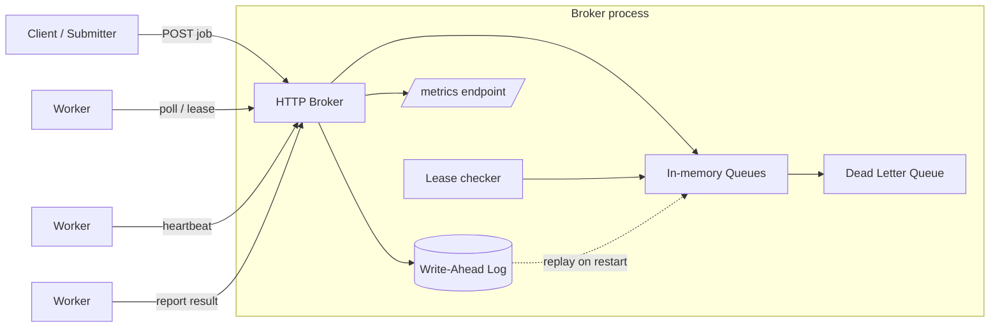
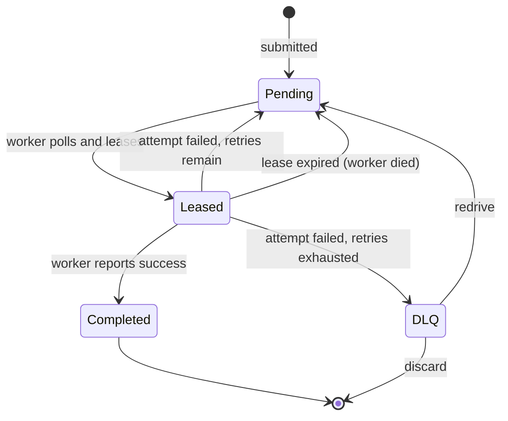

# Hermes Architecture

This document describes how Hermes is put together: its components, how a job flows through the system, and how the pieces behave under failure and restart. For the reasoning behind specific choices, see the [architecture decision records](adr/README.md).

## Components

Hermes has three parts. The broker is the only component that holds authoritative state.

### Broker

The central HTTP server. It receives job submissions, owns the in-memory queues and the dead letter queue, hands jobs out to polling workers under a lease, and writes every state mutation to a durable log before applying it. It also runs a background lease checker and exposes a metrics endpoint.

### Worker pool

A set of N concurrent, anonymous workers. Each worker polls the broker for a job of the type it handles, executes it, and reports the outcome. Workers hold no authoritative state. If a worker dies, the broker notices only that a lease stopped being renewed; it never tracked the worker directly. See ADR-0002.

### Write-ahead log

An append-only, checksummed file the broker writes to before it mutates in-memory state. On startup it is replayed to reconstruct the broker's state. It is the reason a broker restart loses nothing. See ADR-0005 through ADR-0009.

## System diagram

## Job lifecycle

## Request flows

Each flow below follows the write-ahead ordering rule (ADR-0006): the broker appends to the log, then mutates memory, then, past that commit point, updates metrics (ADR-0012).

### Submit a job

1. Client sends `POST /queues/{queueName}/jobs` with the job body.
2. Broker validates the request and builds the job in `Pending` state.
3. Broker appends a submit record to the WAL and fsyncs.
4. Broker adds the job to the queue and increments `jobs_submitted_total` and the `pending` gauge.

### Poll and lease

1. Worker sends `GET /queues/{queueName}/jobs`.
2. If a pending job exists, the broker stamps it with a lease, appends a lease record, moves it to `Leased`, and adjusts the `pending` and `leased` gauges.
3. The job is now invisible to other workers until the lease expires or is released.
4. If no job is available, the broker returns not-found and the worker polls again on its next tick.

### Heartbeat

1. For a long-running job, the worker sends `POST /queues/{queueName}/jobs/{jobId}/heartbeat`.
2. The broker extends the lease, keeping the job from being reclaimed while it is still running.

### Report success

1. Worker sends `PUT /queues/{queueName}/jobs/{jobId}` with the completed result.
2. Broker logs the completion, moves the job to `Completed`, decrements `leased`, and increments `jobs_completed_total`.

### Report failure

1. Worker sends `POST /jobs/{jobId}/fail`.
2. If retries remain, the broker increments the retry count, returns the job to `Pending`, and increments `job_attempt_failures_total`.
3. If retries are exhausted, the broker moves the job to the DLQ and increments both `job_attempt_failures_total` and `jobs_dead_lettered_total`, and the `dlq_size` gauge.

### Lease expiry (worker death)

1. The broker's lease checker periodically scans for leases past their deadline.
2. An expired lease is treated as a failed attempt (ADR-0003) and flows through the same retry-or-dead-letter path as a reported failure.

### DLQ operations

- `GET /queues/{queueName}/dlq` lists dead-lettered jobs.
- `POST /queues/{queueName}/dlq/{jobId}/redrive` returns a job to its queue for another attempt, typically after a fix.
- `DELETE /queues/{queueName}/dlq/{jobId}` permanently discards a job.

## Restart and recovery

On startup the broker opens the WAL and replays it from the beginning:

1. Each record is read using length-and-checksum framing (ADR-0007) and verified.
2. Valid records rebuild the queues and the DLQ.
3. In-flight leases are discarded and their jobs reset to `Pending`; retry counts and next-run timestamps are preserved (ADR-0009).
4. Gauges are restored from the reconstructed state so the first metrics scrape is accurate (ADR-0010).
5. If the final record is torn, recovery stops at the last clean record and keeps everything before it (ADR-0008).

The result is that a broker restart, whether planned or a crash, resumes with no lost jobs and correct live counts.

## Concurrency model

Queue state is shared across concurrent submitters, pollers, and the lease checker. It is guarded by a mutex, using a locked-core pattern: exported methods acquire the lock and delegate to unexported helpers that assume the lock is already held. This avoids the deadlock that Go's non-reentrant `sync.Mutex` would otherwise cause if a helper tried to re-acquire a lock its caller already holds. The full test suite runs under the race detector.
